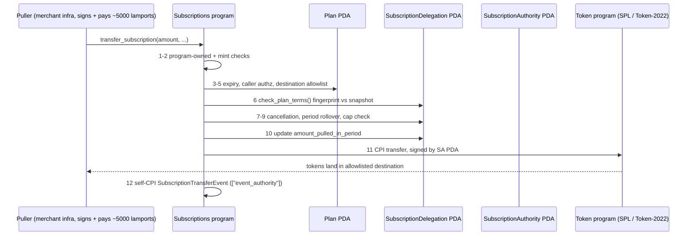

Sometime around June 3, 2026, a program quietly went live on Solana mainnet at address `De1egAFMkMWZSN5rYXRj9CAdheBamobVNubTsi9avR44`. Most of the coverage since has filed it under "recurring payments," which is the least interesting and least accurate way to describe it. What actually shipped is an **authorization layer**: a shared, audited, public primitive that lets a token holder grant someone else a *bounded right to pull funds* — capped by amount, capped by period, restricted by destination, revocable at will — without handing over a key, signing every charge, or trusting a custodian.

**Solana's subscriptions program is a standalone, Cantina-audited on-chain primitive that lets a token holder grant a bounded, revocable right to pull funds — capped by amount, by period, and by destination — without surrendering a key, signing every charge, or trusting a custodian.** That is the whole idea; everything below is the anatomy of how it holds.

If you want a mental model, it's the card-network pre-authorization model without the card network. When you hand a hotel your card, you're not paying; you're granting a scoped pull right that the merchant can exercise later, inside limits, with a dispute trail. This program puts that exact relationship on-chain: the subscriber signs once to authorize, the merchant pulls later, and a program — not a promise — enforces the bounds on every single pull. One limit on the analogy before leaning on it: cards carry dispute, chargeback, and legal rails behind that pre-auth, and this primitive models only the bounded-authorization half — refund policy lives a layer up, with the merchant.

Before going further, two myths need to die, because they dominate the early commentary and both are flat wrong:

**Myth one: "It's a Token-2022 extension."** No. This is a standalone Solana program — separate program ID, separate deployment — that works *with* SPL Token and Token-2022 via CPI. It is easy to confuse with Token-2022's PermanentDelegate extension because both involve delegation, but they are unrelated mechanisms. PermanentDelegate is a property of a mint; this is a program any holder of any compatible token can opt into, per account, reversibly.

**Myth two: "Solana changed the protocol for this."** Also no. There is no SIMD here, no validator upgrade, no consensus change, nothing to do with Alpenglow or any other protocol-level work. This is a userspace deploy: a program built by Moonsong Labs with the Solana Foundation, written with Anza's Pinocchio framework (zero-dependency, no-std Rust), and audited by Cantina. (You'll see "audited by Spearbit" in some write-ups — outdated; Cantina, the merged entity, is correct. You'll also see the name "multi-delegator" floating around — that's the old internal name, surviving only in the audit PDF and a redirect.)

What follows is the full anatomy — the three account types, who signs what, the complete life of a single $5/month pull, the scary-looking `u64::MAX` approval and why it isn't what it looks like — then a concrete build walkthrough with the TypeScript SDK, and an honest accounting of what the program deliberately does not do.

---


## The anatomy: three accounts, three authorization types

The entire system rests on three PDA types. Each one exists to answer a different question, and the design makes more sense once you see which question each account answers.

### 1. SubscriptionAuthority PDA — "who is allowed to move my tokens at all?"

Seeds: `["SubscriptionAuthority", user, tokenMint]` — note the literal CamelCase seed string (the SDK exports it as `SUBSCRIPTION_AUTHORITY_SEED`; every other seed in the program is lowercase).

The seeds contain the user *and* the token mint — one PDA per (user, mint) pair, not one per user. When the user enrolls for a given mint, that mint's PDA is approved as the **single token-account delegate** on the user's token account for that mint, with a `u64::MAX` approval. That's the program's one-time handshake with the token program: instead of the user approving each merchant individually at the token layer (SPL Token only supports one delegate per account anyway), the user approves this one program-controlled PDA once, and all subsequent permission logic moves up into the program where it can be expressive. The SubscriptionAuthority PDA is the *hands* — it signs the actual CPI transfers — but it has no judgment of its own. Every pull it executes must first pass the program's full gate sequence (below). More on the `u64::MAX` optics shortly, because it deserves an honest treatment.

### 2. Plan PDA — "what are the terms?"

Seeds: `["plan", owner, plan_id_le]`. Size: 491 bytes (the SDK exports it as `PLAN_SIZE = 491`: discriminator 1 + owner 32 + bump 1 + status 1 + plan data 456).

This is the merchant's published offer: the mint, the amount per period, the period length, the destination accounts, the pullers allowed to trigger charges. Critically, the plan's **core billing terms — amount, period, mint, destinations — are immutable after creation**. A merchant cannot create a "$5/month" plan and quietly turn it into "$50/week." What *can* be updated post-creation: the plan's status, its `end_ts`, its puller list (up to 4), and its `metadata_uri`. This split is landmine number seven in the wild — "terms are updatable" is a misleading claim you'll see; only the operational fields are, never the financial ones.

### 3. SubscriptionDelegation PDA — "what did *this subscriber* agree to, and where do they stand?"

Seeds: `["subscription", plan_pda, subscriber]`. Size: 155 bytes — a 107-byte header, 24 bytes of **snapshotted plan terms**, then three live counters: `amount_pulled_in_period` (u64), `current_period_start_ts` (i64), and `expires_at_ts` (i64, where 0 means active).

This account is each subscriber's individual ledger against the plan, and the 24-byte terms snapshot is the most important design decision in the whole program — it's the ghost-account defense, covered below. The live counters are what make the cap enforceable: the program knows exactly how much has been pulled in the current period and when that period started, so it can reject any pull that would exceed the agreed amount.

Here's the relationship between all the pieces:

```
  Merchant wallet ──creates/owns──►  Plan PDA (491 bytes)
                                     seeds: ["plan", owner, plan_id_le]
                                     amount/period/mint/destinations IMMUTABLE
                                          ▲
                                          │ references + snapshots terms (24 bytes)
                                          │
  Subscriber wallet ──signs──►  SubscriptionDelegation PDA (155 bytes)
        │            subscribe  seeds: ["subscription", plan_pda, subscriber]
        │                       amount_pulled_in_period / current_period_start_ts
        │                       expires_at_ts (0 = active)
        │
        ├──owns──►  Token account (USDC, etc.)
        │              delegate = SubscriptionAuthority PDA, approved u64::MAX
        │                                   ▲
        └──one-time enroll──────────────────┘
                    SubscriptionAuthority PDA — one per (user, mint)
                    seeds: ["SubscriptionAuthority", user, tokenMint]
                    signs the actual CPI transfers — but only after
                    the program's gate sequence passes
```


### Three authorization types, one program

Subscription plans are actually the third of three authorization shapes the program supports. The other two come from the program's direct-delegation instruction set (the ADR-001 set: `initSubscriptionAuthority` / `closeSubscriptionAuthority`, `createFixedDelegation` / `createRecurringDelegation`, `transferFixed` / `transferRecurring`, `revokeDelegation`):

| Type | Shape | Cap semantics | Built for |
|---|---|---|---|
| **Fixed delegation** | One-shot grant | Cumulative cap + optional expiry | AI agent budgets, card-style pre-auth holds |
| **Recurring delegation** | Repeating grant | Per-period cap that resets; period in **seconds** (`periodLengthS`); overall expiry | Payroll, allowances, fine-grained metering |
| **Subscription plan** | Merchant-published, many subscribers | Plan terms snapshotted per subscriber; per-period cap | SaaS billing, memberships |

The signing split is consistent across all three and is the part to internalize: **the subscriber signs setup, cancel, and resume. The merchant — or one of up to four whitelisted pullers — signs each pull, and pays the transaction fee for it** (~5,000 lamports per pull). The subscriber is never asked to sign a charge. That asymmetry is the whole point: authorization is granted once and bounded forever after; execution is the payee's problem.

The subscription-plan instruction set, with discriminators: `create_plan` (7), `update_plan` (8), `delete_plan` (9), `transfer_subscription` (10), `subscribe` (11), `cancel_subscription` (12), `resume_subscription` (13).

### The life of one $5/month pull


Say a subscriber holds USDC and has subscribed to a merchant's $5/month plan. A month passes. The merchant's billing infrastructure (more on *whose* infrastructure in the tradeoffs section) submits a `transfer_subscription` instruction. Here is everything that happens before a single token moves — the full gate sequence, in order:

1. **Program-owned check.** The state accounts passed in must actually be owned by the subscriptions program. You can't feed it look-alike accounts you fabricated.
2. **Mint match.** The token accounts and the plan must agree on the mint. No pulling USDT against a USDC plan.
3. **Plan expiry check.** If the plan's `end_ts` has passed, the plan is dead and the pull fails.
4. **Caller authorization.** The transaction signer must be the plan owner or one of the (≤4) whitelisted pullers. A random third party cannot trigger a charge even though the charge would go to the merchant — pull rights are themselves permissioned.
5. **Destination allowlist.** The receiving token account must be one of the plan's immutable destinations. Even a fully authorized puller can't redirect funds to a fresh address.
6. **`check_plan_terms()` — the ghost-account fingerprint.** The terms snapshotted in the SubscriptionDelegation PDA at subscribe time (plus the plan's `created_at`) are compared against the live Plan account. Any mismatch throws `PlanTermsMismatch`. This is the defense against a subtle account-model attack: close a plan, recreate a different plan at the same address (same seeds), and harvest the old subscribers under new terms. The fingerprint makes the old delegations inert against the impostor — the subscriber's agreement binds to the *terms*, not just the *address*.
7. **Cancellation check.** A cancelled subscription doesn't pull. (Cancellation is the subscriber's unilateral, sign-once right — and so is `resume_subscription` if they change their mind.)
8. **Period rollover.** If `current_period_start_ts` plus the period has elapsed, the program rolls the window forward and resets `amount_pulled_in_period`.
9. **Cap enforcement.** The requested amount plus `amount_pulled_in_period` must fit inside the period's cap. The merchant can split a period's charge into multiple pulls if they like, but the period total is a hard ceiling.
10. **State update.** `amount_pulled_in_period` and the period bookkeeping are written; in the documented flow, this state write comes before the transfer itself.
11. **CPI transfer.** Now, finally, the SubscriptionAuthority PDA signs a CPI into the token program (SPL Token or Token-2022) moving $5 of USDC from the subscriber's token account to the allowlisted destination.
12. **Event emission.** A `SubscriptionTransferEvent` is emitted via self-CPI (the `["event_authority"]` pattern), giving indexers a durable record. The program emits `Created`, `Cancelled`, `Resumed`, and `Transfer` events across the lifecycle.

As a sequence diagram:



Twelve gates, one transfer. That density of validation is what lets the dangerous-looking part of the design be safe — which brings us to the elephant.

### The u64::MAX paradox


When a user enrolls, their wallet will show a token-account delegate approval of `u64::MAX` — the maximum representable amount — granted to a PDA. Wallet UIs render this as "unlimited spending approval," and users trained by years of ERC-20 approval-drainer incidents will, reasonably, flinch.

Here's the honest version. The `u64::MAX` approval is real at the token layer, and at the token layer alone it *would* be unlimited. But the delegate is not a person or an externally-owned key — it's a PDA that can only sign inside the subscriptions program, and the program will only produce that signature at the end of the twelve-gate sequence above. The effective spending power against your account is the sum of the caps in your Delegation PDAs — your $5/month subscription can pull $5 a month, full stop — and revoking a delegation or cancelling a subscription closes that path entirely. The `u64::MAX` exists because SPL Token's single-delegate, single-amount approval model is too crude to express "many counterparties, each individually bounded," so the program takes maximal token-layer authority once and re-derives all the actual limits in its own state, where they can be per-merchant, per-period, and revocable.

So the claim "this gives a program unlimited spending power over your wallet" is *technically describable and substantively misleading* — the correct statement is that bounded spending power is enforced one layer up, by audited program logic, gated by accounts you control. The legitimate criticism is about *optics*: until wallet UIs learn to render this pattern, the approval screen will scare people. That's a real adoption problem, just not a security one.

---

## Build it: a merchant flow, end to end

Time to make it concrete. Suppose you run a SaaS and want to bill $5/month in USDC. Devnet has a live demo at `solana-subscriptions-program.vercel.app`, and the program repo is `github.com/solana-program/subscriptions` (justfile-driven, with Surfpool for local testing). There's no dedicated CLI yet; the TypeScript SDK is the paved road:

```
pnpm add @solana/subscriptions @solana/kit @solana/kit-plugin-rpc @solana/kit-plugin-signer @solana-program/token
```

*A note on versions, current as of publication (June 2026): `@solana/subscriptions@0.3.0` is the latest stable release and is what this walkthrough targets. A `v0.4.0-rc.1` pre-release landed mid-June — a release candidate, not stable — and the on-chain program itself is unchanged since its June 2 launch, so nothing here is dated by it.*

**Step 1 — the merchant publishes the plan.** One call, from the merchant's client:

```ts
merchantClient.subscriptions.instructions.createPlan({
  planId, mint, amount, periodHours, endTs: 0n,
  destinations, pullers, metadataUri
}).sendTransaction();
```

On-chain, this creates the **Plan PDA** at `["plan", owner, plan_id_le]` — 491 bytes (`PLAN_SIZE` in the SDK) recording everything in that argument object. Choose carefully: `mint`, `amount`, `periodHours`, and `destinations` are now immutable for the life of the plan. `endTs: 0n` means no scheduled end. `pullers` is your operational allowlist (max 4) and *can* be rotated later via `update_plan`, as can `metadataUri` (point it at your plan's display metadata) and the plan's status.

One gotcha that will bite you exactly once: **`amount` is in base units of the mint**. For a 6-decimal token, `5_000_000` = 5 tokens — five million base units, not five. Get this wrong in the cheap direction and you'll bill a millionth of what you meant each month; get it wrong the other way and gate 9 will at least stop you from pulling it, but your subscribers will see an alarming plan.

**Step 2 — the subscriber subscribes.** From the subscriber's client:

```ts
subscribe({merchant, planId, tokenMint});
```

This is the only signature the subscriber will ever provide for the billing relationship (until they cancel). On-chain it does two things: ensures their **SubscriptionAuthority PDA** is set as the delegate on their USDC token account (the one-time `u64::MAX` handshake discussed above), and creates their **SubscriptionDelegation PDA** at `["subscription", plan_pda, subscriber]` — including the 24-byte snapshot of your plan's terms that gate 6 will check on every future pull. A nice SDK detail: the TypeScript SDK **auto-fetches the live plan terms** during `subscribe`, so the snapshot is taken for you. (The Rust crate — `subscriptions = "^0.1"`, Codama-generated — is lower-level: its `SubscribeBuilder` needs the terms pre-fetched and handed in.)

**Step 3 — your infrastructure pulls.** Each period, a signer from your `pullers` list submits:

```ts
transferSubscription({
  caller, delegator, tokenMint, subscriptionPda, planPda,
  amount, receiverAta, tokenProgram
});
```

`caller` is your puller, `delegator` is the subscriber, `receiverAta` must be one of the plan's immutable destinations, and `tokenProgram` is whichever token program the mint lives under — SPL Token works unconditionally; Token-2022 works only for mints with a restricted extension set (the full rejection list is covered below). The instruction runs the twelve gates, moves the USDC, updates the subscriber's period counters, and emits the `Transfer` event your indexer or webhook layer can consume. Your cost: roughly 5,000 lamports per pull, paid by the puller.

That's the whole integration surface: one call to publish, one signature to enroll, one permissioned instruction per billing cycle. The on-chain part is genuinely this small. The off-chain part is where the honest conversation starts.

---

## What it deliberately doesn't do

The program is narrow on purpose, and the gaps are load-bearing facts for anyone planning to build on it.

**There is no scheduler.** This is the big one, and it's landmine four and eight rolled together. The program does on-chain *validation* of pulls; it never *initiates* them. Nothing on Solana wakes up on the first of the month and runs your billing. Merchants run their own pull infrastructure — a cron job, a keeper service, whatever — and pay ~5,000 lamports per pull for the privilege. If you're thinking "Clockwork solved this," it didn't and it can't: Clockwork is dead, the on-chain automation gap it left is unfilled, and this program does not replace it — it solves *authorization*, not *execution*. The two are complementary layers and only one of them shipped. (The flip side: at ~5,000 lamports per pull, even a six-figure subscriber base is rounding-error infrastructure cost; the engineering burden is the real price, not the lamports.)

**Token-2022 support is narrower than the headline claims — the SDK's own error table says so.** Some coverage (and even official-docs phrasing) says Token-2022 is supported "including confidential transfers." The SDK contradicts that: `@solana/subscriptions@0.3.0` ships a dedicated rejection error for each disallowed mint extension — `MINT_HAS_CONFIDENTIAL_TRANSFER` (118), `MINT_HAS_NON_TRANSFERABLE` (119), `MINT_HAS_PERMANENT_DELEGATE` (120), `MINT_HAS_TRANSFER_HOOK` (121), `MINT_HAS_TRANSFER_FEE` (122), `MINT_HAS_MINT_CLOSE_AUTHORITY` (123), `MINT_HAS_PAUSABLE` (124). So the honest statement is: **Token-2022 mints are supported only with a restricted extension set** — confidential transfer, transfer fee, permanent delegate, non-transferable, pausable, mint close authority, and configured transfer hooks are all rejected. Where docs claims conflict with these constants, trust the constants (they're generated from the program's IDL); the discrepancy itself is worth knowing about. The practical consequence stands, and is broader than the hook case alone: compliance-oriented tokens that express policy through Token-2022 extensions — hooks for screening, transfer fees, permanent delegates — are incompatible with this program today.

**No native SOL.** The program operates on token accounts, full stop. The unqualified claim "it supports SOL" is false; the accurate version is the standard workaround — wrap to wSOL and subscribe with that.

**Destinations are immutable (pullers, by contrast, can be rotated).** The puller list — capped at four — is updatable via `update_plan`, so rotating a compromised or retired puller key is routine. Destinations are the hard constraint: if you rotate your treasury — new custodian, new multisig, compromised destination key — you cannot point existing plans at the new address. Treasury rotation means sunsetting the plan and migrating every subscriber through a fresh subscribe flow. Design your `destinations` list with rotation in mind *before* you publish, because the program will not let you fix it after.

**Plan periods are hour-granularity — but direct recurring delegations are not.** A subscription plan's `periodHours` runs 1 to 8760 — one hour to one year. Monthly SaaS billing, weekly payroll, daily allowances: all fine at the plan layer. But the hours constraint is a *plan* parameter, not a program-wide one: direct recurring delegations take their period in **seconds** (`periodLengthS` in the SDK), so sub-hourly — even per-minute — metering is possible if you drop down from the merchant-published-plan layer to a bilateral recurring delegation. If you need fine-grained usage metering, that's the shape to reach for; plans stay hourly-or-coarser.

**Audit scope has an edge.** Cantina's audit covers the program up to commit `b4b0345f`. Per the repo's `AUDIT_STATUS.md` (dated 2026-04-08), main-branch commits past that point are unaudited. If you're depositing real treasury flow on this, know which deployed code you're trusting and where the audited boundary sits.

None of these are flaws exactly — they're the shape of a v1 that chose to do one thing (bounded pull authorization) completely rather than five things loosely. But each one should appear in your design review.

---

## The Canadian angle, briefly

The proven pattern to copy is API billing. Helius — the Solana RPC/API provider — is among the program's design partners (alongside Confirmo, Dynamic, Majority, Mesh, and Meow), using it for API-tier billing: publish a plan per tier, customer subscribes once, infrastructure pulls each period, caps and cancellation enforced by the program rather than by a billing department. There is nothing region-specific about that pattern. A Canadian SaaS — your analytics startup in Toronto, your dev-tools shop in Waterloo — can implement exactly this flow today with USDC: a `createPlan` per pricing tier, a subscribe button in the dashboard, a puller process next to the existing billing cron. No payment processor in the pull path, subscriber-side cancellation that actually works, and a public audit trail of every charge via the event stream.

The forward-looking piece is the currency. CADD — the regulated Canadian-dollar stablecoin backed by Shopify, Wealthsimple, Shakepay, National Bank, and ATB, launched May 2026 on Base, Ethereum, and Tempo — has Solana support planned but **not live**, and the day it lands, every mechanism in this article works unchanged with CAD-denominated plans: the program is mint-agnostic, so "subscriptions in Canadian dollars, enforced by a program" stops being a thought experiment the moment the mint exists. Until then: the rails are live, the authorization layer is audited, and the missing piece is the CAD mint itself.

---

## FAQ

<div class="faq">

<div class="faq-item">
<div class="faq-q">What is Solana's subscriptions program?</div>
<div class="faq-a">Solana's subscriptions program is a standalone, Cantina-audited on-chain program that lets a token holder grant someone a bounded, revocable right to pull funds — capped by amount, period, and destination — without handing over a key or signing each charge. It is not a Token-2022 extension and not a protocol change; it is a userspace program built by Moonsong Labs with the Solana Foundation, deployed at address <code>De1egAFMkMWZSN5rYXRj9CAdheBamobVNubTsi9avR44</code> around June 2026.</div>
</div>

<div class="faq-item">
<div class="faq-q">Is the subscriptions program a Token-2022 extension or a Solana protocol change?</div>
<div class="faq-a">No to both. It is a standalone Solana program with its own program ID that works with SPL Token and Token-2022 via CPI. It is unrelated to Token-2022's PermanentDelegate extension (that is a property of a mint), and it required no SIMD, validator upgrade, or consensus change — it is a normal userspace deploy.</div>
</div>

<div class="faq-item">
<div class="faq-q">Why does the program ask for a u64::MAX (unlimited) token approval?</div>
<div class="faq-a">The <code>u64::MAX</code> approval is granted to a program-controlled PDA, not a person or external key. That PDA can only sign inside the subscriptions program, and only after a twelve-step gate sequence passes. Your real spending exposure is the sum of the per-period caps in your delegations — a $5/month subscription can pull $5 a month, full stop — and cancelling or revoking closes that path. The unlimited figure exists only because SPL Token's single-delegate model is too crude to express many counterparties each individually bounded; the real limits live in the program's own state.</div>
</div>

<div class="faq-item">
<div class="faq-q">Does the subscriptions program automatically charge subscribers each month?</div>
<div class="faq-a">No. The program validates pulls; it never initiates them. There is no on-chain scheduler — nothing on Solana wakes up on the first of the month. Merchants run their own pull infrastructure (a cron job or keeper service) and pay roughly 5,000 lamports per pull. The program solves authorization, not execution.</div>
</div>

<div class="faq-item">
<div class="faq-q">Can the subscriptions program charge in non-USD currencies or native SOL?</div>
<div class="faq-a">The program is mint-agnostic, so any compatible SPL or Token-2022 mint works — including a future Canadian-dollar stablecoin once it lists on Solana. It does not support native SOL directly; the standard workaround is to wrap SOL to wSOL and subscribe with that. Token-2022 mints are supported only with a restricted extension set (confidential transfer, transfer fee, transfer hook, permanent delegate, non-transferable, pausable, and mint close authority are all rejected).</div>
</div>

<div class="faq-item">
<div class="faq-q">How does a merchant integrate the subscriptions program?</div>
<div class="faq-a">The integration surface is three calls. The merchant publishes a plan once with <code>createPlan</code> (setting an immutable mint, amount, period, and destinations); each subscriber signs once with <code>subscribe</code> to authorize; then the merchant's infrastructure calls <code>transferSubscription</code> each billing cycle. The TypeScript SDK (<code>@solana/subscriptions</code>) is the paved road; there is no dedicated CLI yet.</div>
</div>

</div>

---

## Sources

Drawn from the verified research digest for this piece (full URL list preserved in the research transcript):

- solana.com — program announcement (news) and documentation pages for the subscriptions program
- github.com/solana-program/subscriptions — program repository, including ADR-001/ADR-002 design records and `AUDIT_STATUS.md`
- solana-subscriptions-program.vercel.app — devnet demo
- Cantina audit of the program (formerly published under the "multi-delegator" name)
- MEXC, Cointrust, and The Defiant coverage of the mainnet launch
- CoinDesk coverage of the CADD stablecoin launch (2026-05-04)
- superteam.ca — Superteam Canada
- github.com/tempoxyz/mpp-specs/pull/270 — adjacent agentic-payments spec (MPP)

